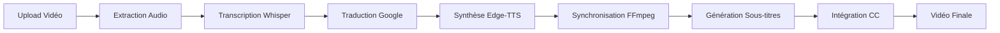

# 🎬 Video Translator App

[](https://www.python.org/downloads/)
[](https://reactjs.org/)
[](LICENSE)
[](https://flask.palletsprojects.com/)

> Application professionnelle de traduction vidéo propulsée par l'IA avec authentification, support multilingue, synthèse vocale naturelle et synchronisation automatique.

[English](#) | [Français](#) | [العربية](#)

---

## 📋 Table des matières

- [Aperçu](#-aperçu)
- [Fonctionnalités](#-fonctionnalités)
- [Démonstration](#-démonstration)
- [Architecture](#-architecture)
- [Installation](#-installation)
- [Configuration](#-configuration)
- [Utilisation](#-utilisation)
- [API Documentation](#-api-documentation)
- [Technologies](#-technologies)
- [Structure du Projet](#-structure-du-projet)
- [Contribution](#-contribution)
- [Roadmap](#-roadmap)
- [License](#-licence)

---

## 🌟 Aperçu

**Video Translator App** est une solution complète de traduction vidéo automatique utilisant les technologies d'intelligence artificielle les plus avancées. L'application permet de transcrire, traduire et doubler des vidéos dans plus de 50 langues avec une qualité professionnelle.


### Cas d'usage

- 🎓 **Éducation** : Traduire des cours et conférences pour un public international
- 🎥 **Création de contenu** : Adapter vos vidéos YouTube/TikTok pour différents marchés
- 🏢 **Entreprise** : Localiser des formations et présentations corporate
- 📺 **Médias** : Sous-titrer et doubler du contenu multimédia rapidement

### Points forts

- ✅ **Précision 99%** avec Whisper AI (OpenAI)
- ✅ **Audio naturel HD** avec Edge-TTS (Microsoft)
- ✅ **Synchronisation parfaite** audio/sous-titres avec FFmpeg
- ✅ **Sous-titres CC intégrés** directement dans la vidéo
- ✅ **Authentification sécurisée** avec JWT
- ✅ **Historique complet** des traductions
- ✅ **Interface moderne** et intuitive

---

## ✨ Fonctionnalités

### 🎤 Transcription Intelligente

- **Reconnaissance vocale automatique (ASR)** avec Whisper AI
- **Détection automatique de la langue source**
- **Support de 50+ langues** pour la transcription
- **Précision professionnelle** avec plusieurs modèles Whisper (tiny, base, small, medium, large)

### 🌍 Traduction Multilingue

- **9+ langues principales** : Français, Anglais, Espagnol, Allemand, Arabe, Italien, Portugais, Chinois, Japonais
- **Traduction contextuelle** avec Google Translate et Deep Translator
- **Traduction de sous-titres multilingues** simultanée
- **Qualité professionnelle** avec gestion des nuances

### 🎙️ Synthèse Vocale Avancée

- **Edge-TTS (Microsoft)** : Voix naturelles et expressives HD
- **gTTS (Google)** : Alternative rapide et fiable
- **Voix natives** pour chaque langue
- **Ajustement automatique** du débit et de l'intonation

### ⚡ Synchronisation Automatique

- **Alignement temporel précis** entre audio traduit et vidéo originale
- **Calcul des ratios de durée** avec FFprobe
- **Ajustement automatique des timestamps** des sous-titres
- **Synchronisation au milliseconde près**

### 📝 Sous-titres CC Professionnels

- **Génération automatique** de sous-titres SRT et WebVTT
- **Intégration native** comme pistes CC dans la vidéo finale
- **Support multilingue** avec plusieurs pistes de sous-titres
- **Métadonnées complètes** (langue, titre) pour chaque piste

### 🔐 Authentification et Gestion

- **Système d'authentification JWT** sécurisé
- **Base de données SQLite** pour les utilisateurs
- **Historique des traductions** par utilisateur
- **Statistiques détaillées** (nombre de traductions, langues utilisées)
- **Gestion de profil** et changement de mot de passe

### 🎨 Interface Utilisateur

- **Design moderne** avec React et CSS animations
- **Responsive** et adapté mobile
- **Drag & Drop** pour l'upload de vidéos
- **Prévisualisation vidéo** avec lecteur intégré
- **Indicateurs de progression** en temps réel

---

## 🎥 Démonstration

### Écran d'accueil
```
Interface moderne avec statistiques en temps réel
- 99% de précision
- 50+ langues supportées
- 10K+ vidéos traitées
- < 5min temps moyen
```

### Processus de traduction

```
1. Upload de la vidéo (MP4, AVI, MOV, MKV, WEBM)
2. Configuration des langues source/cible
3. Sélection des sous-titres multilingues
4. Traitement automatique :
   📤 Upload → 🎵 Audio → 🧠 IA → 🌍 Traduction → 🎬 Final
5. Téléchargement de la vidéo traduite avec CC
```

### Exemple de traduction

**Entrée** : Vidéo en français (5 minutes)
**Sortie** : 
- Vidéo traduite en anglais avec audio doublé
- Sous-titres CC intégrés (EN, FR, ES, DE)
- Synchronisation parfaite
- Temps de traitement : ~12 minutes

---

## 🏗️ Architecture

### Stack Technique

```
┌─────────────────────────────────────────────────────────┐
│                    FRONTEND (React)                     │
│  ┌──────────┬──────────┬──────────┬──────────────────┐  │
│  │  Home    │ Translate│  Guide   │    History       │  │
│  │  Auth    │  Video   │   FAQ    │  Statistics      │  │
│  └──────────┴──────────┴──────────┴──────────────────┘  │
│                                                         │
│              React Router + Context API                 │
└─────────────────────────────────────────────────────────┘
                            ↕ HTTP/REST API
┌─────────────────────────────────────────────────────────┐
│                   BACKEND (Flask)                       │
│  ┌──────────────────────────────────────────────────┐   │
│  │  API Routes:                                     │   │
│  │  • /api/upload          • /api/download          │   │
│  │  • /api/auth/register   • /api/auth/login        │   │
│  │  • /api/user/history    • /api/user/stats        │   │
│  └──────────────────────────────────────────────────┘   │
│                                                         │
│  ┌──────────┬──────────┬──────────┬──────────────────┐  │
│  │ Whisper  │ FFmpeg   │Edge-TTS  │  SQLite DB       │  │
│  │   AI     │Processing│Synthesis │  (Users)         │  │
│  └──────────┴──────────┴──────────┴──────────────────┘  │
└─────────────────────────────────────────────────────────┘
```

### Flux de Traitement



---

## 📦 Installation

### Prérequis

- **Python 3.8+**
- **Node.js 16+** et npm
- **FFmpeg** (obligatoire)

### 1. Installation du Backend

```bash
# Cloner le repository
git clone https://github.com/AchrafAllali/video-translator-app.git
cd video-translator-app

# Créer un environnement virtuel
python -m venv venv

# Activer l'environnement
# Windows
venv\Scripts\activate
# macOS/Linux
source venv/bin/activate

# Installer les dépendances Python
pip install -r requirements.txt
```

#### Fichier `requirements.txt`

```txt
flask==3.0.0
flask-cors==4.0.0
werkzeug==3.0.1
openai-whisper==20231117
deep-translator==1.11.4
edge-tts==6.1.9
pydub==0.25.1
PyJWT==2.8.0
```

### 2. Installation de FFmpeg

**Windows (avec Chocolatey)** :
```bash
choco install ffmpeg
```

**macOS (avec Homebrew)** :
```bash
brew install ffmpeg
```

**Linux (Ubuntu/Debian)** :
```bash
sudo apt update
sudo apt install ffmpeg
```

**Vérification** :
```bash
ffmpeg -version
```

### 3. Installation du Frontend

```bash
# Aller dans le dossier frontend
cd frontend

# Installer les dépendances
npm install

# Ou avec yarn
yarn install
```

### 4. Configuration de la Base de Données

La base de données SQLite sera créée automatiquement au premier lancement du backend.

```bash
# La BD sera créée ici
users.db
```

---

## ⚙️ Configuration

### Backend Configuration

**1. Variables d'environnement** (optionnel)

Créer un fichier `.env` à la racine :

```env
# Secret Key pour JWT (IMPORTANT : Changez en production)
SECRET_KEY=votre_cle_secrete_changez_moi_en_production_123456

# Configuration Flask
FLASK_ENV=development
FLASK_DEBUG=True

# Port du serveur
PORT=5000

# Dossier uploads
UPLOAD_FOLDER=./uploads

# Configuration base de données
DB_PATH=users.db
```

**2. Configuration Whisper**

Modèles disponibles (dans l'ordre de taille/précision) :
- `tiny` : Le plus rapide, moins précis
- `base` : Équilibré (recommandé)
- `small` : Précis
- `medium` : Très précis
- `large` : Optimal mais lent

**3. Langues supportées**

Le backend supporte :
```python
SUPPORTED_LANGUAGES = [
    'en', 'fr', 'es', 'de', 'ar', 
    'it', 'pt', 'zh', 'ja'
]
```

### Frontend Configuration

**1. Configuration API**

Dans `Translate.js`, modifier l'URL de l'API si nécessaire :

```javascript
const API_BASE = 'http://localhost:5000/api';
```

**2. Configuration React Router**

Le routage est défini dans `App.js` :
```javascript
- / : Accueil
- /translate : Interface de traduction
- /guide : Guide d'utilisation
- /history : Historique des traductions
- /auth : Authentification (login/register)
```

---

## 🚀 Utilisation

### Démarrage de l'application

**Terminal 1 - Backend** :
```bash
# Activer l'environnement virtuel
source venv/bin/activate  # ou venv\Scripts\activate sur Windows

# Lancer le serveur Flask
python backend.py
```

Le backend sera accessible sur : `http://localhost:5000`

**Terminal 2 - Frontend** :
```bash
cd frontend
npm start
```

Le frontend sera accessible sur : `http://localhost:3000`

### Workflow complet

#### 1. Créer un compte

```
http://localhost:3000/auth
→ S'inscrire avec nom, email, mot de passe
→ Connexion automatique après inscription
```

#### 2. Traduire une vidéo

```
http://localhost:3000/translate

Étapes :
1. Configurer les paramètres dans la sidebar :
   - Modèle Whisper : base (recommandé)
   - Langue source : auto (détection automatique)
   - Langue cible : Choisir la langue
   - Sous-titres multilingues : Sélectionner langues additionnelles
   - Méthode TTS : Edge-TTS (recommandé)

2. Uploader la vidéo :
   - Drag & Drop ou cliquer "Choisir un fichier"
   - Formats supportés : MP4, AVI, MOV, MKV, WEBM
   - Taille max : 200 MB

3. Lancer la traduction :
   - Cliquer "🚀 Lancer la Traduction IA"
   - Suivre la progression en temps réel

4. Télécharger les résultats :
   - Vidéo traduite avec audio et sous-titres CC
   - Audio traduit seul (MP3)
   - Sous-titres SRT pour chaque langue
```

#### 3. Consulter l'historique

```
http://localhost:3000/history

- Voir toutes vos traductions précédentes
- Statistiques d'utilisation
- Télécharger à nouveau vos projets
```

### Utilisation de l'API REST

#### Authentification

**Inscription** :
```bash
curl -X POST http://localhost:5000/api/auth/register \
  -H "Content-Type: application/json" \
  -d '{
    "name": "achraf allali",
    "email": "achraf@example.com",
    "password": "motdepasse123"
  }'
```

**Connexion** :
```bash
curl -X POST http://localhost:5000/api/auth/login \
  -H "Content-Type: application/json" \
  -d '{
    "email": "achraf@example.com",
    "password": "motdepasse123"
  }'
```

Réponse :
```json
{
  "success": true,
  "token": "eyJ0eXAiOiJKV1QiLCJhbGc...",
  "user": {
    "id": 1,
    "email": "achraf@example.com",
    "name": "achraf allali"
  }
}
```

#### Traduction de vidéo

```bash
curl -X POST http://localhost:5000/api/upload \
  -H "Authorization: Bearer YOUR_JWT_TOKEN" \
  -F "video=@/path/to/video.mp4" \
  -F "langue_source=fr" \
  -F "langue_cible=en" \
  -F "modele_whisper=base" \
  -F "langues_sous_titres=es,de"
```

#### Récupérer l'historique

```bash
curl -X GET http://localhost:5000/api/user/history \
  -H "Authorization: Bearer YOUR_JWT_TOKEN"
```

---

## 📚 API Documentation

### Endpoints Publics

| Méthode | Endpoint | Description |
|---------|----------|-------------|
| GET | `/` | Status de l'API |
| GET | `/api/status` | Vérifier disponibilité des dépendances |
| GET | `/api/languages` | Liste des langues supportées |

### Endpoints Authentification

| Méthode | Endpoint | Description | Auth |
|---------|----------|-------------|------|
| POST | `/api/auth/register` | Créer un compte | ❌ |
| POST | `/api/auth/login` | Se connecter | ❌ |
| GET | `/api/auth/me` | Infos utilisateur | ✅ |
| PUT | `/api/auth/update-profile` | Modifier profil | ✅ |
| PUT | `/api/auth/change-password` | Changer mot de passe | ✅ |

### Endpoints Traduction

| Méthode | Endpoint | Description | Auth |
|---------|----------|-------------|------|
| POST | `/api/upload` | Uploader et traduire vidéo | ✅ |
| GET | `/api/download/{file_id}` | Télécharger vidéo traduite | ❌ |
| GET | `/api/preview/{file_id}` | Prévisualiser vidéo | ❌ |
| GET | `/api/audio/{file_id}` | Télécharger audio traduit | ❌ |
| GET | `/api/subtitles/{file_id}/{langue}` | Télécharger sous-titres | ❌ |

### Endpoints Historique

| Méthode | Endpoint | Description | Auth |
|---------|----------|-------------|------|
| GET | `/api/user/history` | Historique des traductions | ✅ |
| GET | `/api/user/stats` | Statistiques utilisateur | ✅ |
| DELETE | `/api/user/history/{id}` | Supprimer une traduction | ✅ |

### Formats de Requête/Réponse

**Upload Vidéo** :
```json
POST /api/upload
Content-Type: multipart/form-data

{
  "video": <file>,
  "modele_whisper": "base",
  "langue_source": "fr",
  "langue_cible": "en",
  "langues_sous_titres": "es,de",
  "methode_tts": "Edge-TTS",
  "generer_sous_titres": true,
  "synchronisation_ffmpeg": true,
  "utiliser_demo": false
}

Response 200:
{
  "success": true,
  "file_id": "uuid-123",
  "languages": {
    "source": "fr",
    "target": "en"
  },
  "transcription": {
    "original": "Texte original...",
    "translated": "Translated text...",
    "language": "fr"
  },
  "subtitles": ["en", "es", "de"],
  "cc_enabled": true,
  "synchronized": true,
  "duration_ratio": 1.05,
  "download_url": "/api/download/uuid-123",
  "preview_url": "/api/preview/uuid-123"
}
```

---

## 🛠️ Technologies

### Backend

| Technologie | Version | Usage |
|-------------|---------|-------|
| **Python** | 3.8+ | Langage principal |
| **Flask** | 3.0+ | Framework web |
| **Whisper AI** | Latest | Transcription ASR |
| **Edge-TTS** | 6.1+ | Synthèse vocale |
| **FFmpeg** | 4.4+ | Traitement audio/vidéo |
| **Deep Translator** | 1.11+ | Traduction multilingue |
| **SQLite** | 3.x | Base de données |
| **PyJWT** | 2.8+ | Authentification JWT |

### Frontend

| Technologie | Version | Usage |
|-------------|---------|-------|
| **React** | 18.0+ | Framework UI |
| **React Router** | 6.x | Navigation |
| **CSS3** | - | Styling + Animations |
| **Lucide React** | Latest | Icônes |

### DevOps

| Outil | Usage |
|-------|-------|
| **Git** | Contrôle de version |
| **npm/yarn** | Gestion dépendances JS |
| **pip** | Gestion dépendances Python |
| **venv** | Environnement virtuel Python |

---

## 📁 Structure du Projet

```
video-translator-app/
│
├── frontend/                      # Application React
│   ├── public/
│   │   ├── index.html
│   │   └── favicon.ico
│   ├── src/
│   │   ├── components/           # Composants React
│   │   │   ├── Auth.js          # Authentification
│   │   │   ├── Home.js          # Page d'accueil
│   │   │   ├── Translate.js     # Interface traduction
│   │   │   ├── Guide.js         # Guide d'utilisation
│   │   │   └── History.js       # Historique
│   │   ├── context/
│   │   │   └── AuthContext.js   # Context API auth
│   │   ├── styles/
│   │   │   ├── Home.css
│   │   │   └── Translate.css
│   │   ├── App.js               # Routeur principal
│   │   └── index.js
│   ├── package.json
│   └── package-lock.json
│
├── backend/                       # Serveur Flask
│   ├── backend.py                # API principale
│   ├── backend_auth.py           # Routes authentification
│   ├── users.db                  # Base de données SQLite
│   └── uploads/                  # Fichiers temporaires
│       └── {uuid}/
│           ├── original_video.mp4
│           ├── audio.mp3
│           ├── audio_traduit.mp3
│           ├── video_finale_cc.mp4
│           ├── subtitles_{lang}.srt
│           └── subtitles_{lang}.vtt
│
├── requirements.txt              # Dépendances Python
├── .gitignore
├── README.md                     # Ce fichier
└── LICENSE
```

---

## 🤝 Contribution

Les contributions sont les bienvenues ! Voici comment contribuer :

### 1. Fork le projet

```bash
git clone https://github.com/AchrafAllali/video-translator-app.git
cd video-translator-app
```

### 2. Créer une branche

```bash
git checkout -b feature/AmazingFeature
```

### 3. Commiter les changements

```bash
git commit -m 'Add: Nouvelle fonctionnalité incroyable'
```

### 4. Push vers la branche

```bash
git push origin feature/AmazingFeature
```

### 5. Ouvrir une Pull Request

Décrivez vos changements et soumettez votre PR !

### Guidelines de Contribution

- ✅ Suivre PEP 8 pour le code Python
- ✅ Utiliser ESLint pour le code JavaScript
- ✅ Ajouter des tests pour les nouvelles fonctionnalités
- ✅ Mettre à jour la documentation
- ✅ Commenter le code complexe
- ✅ Écrire des messages de commit clairs

---

## 🗺️ Roadmap

### Version 1.0 (Actuelle)

- ✅ Transcription Whisper AI
- ✅ Traduction multilingue
- ✅ Synthèse vocale Edge-TTS
- ✅ Sous-titres CC intégrés
- ✅ Synchronisation automatique
- ✅ Authentification JWT
- ✅ Historique des traductions
- ✅ Interface React moderne

### Version 1.1 (Prochaine)

- ⏳ Clonage de voix avec AI
- ⏳ Support de plus de langues (100+)
- ⏳ Traitement par lots (plusieurs vidéos)
- ⏳ API GraphQL
- ⏳ Webhooks pour notifications
- ⏳ Intégration YouTube/Vimeo

### Version 2.0 (Future)

- 📅 Traduction en temps réel (streaming)
- 📅 Support vidéo 4K/8K
- 📅 Interface mobile native (iOS/Android)
- 📅 Cloud storage (AWS S3, Google Cloud)
- 📅 Collaboration en équipe
- 📅 Dashboard analytics avancé
- 📅 IA générative pour sous-titres créatifs
- 📅 Support de 200+ langues

---

## 🐛 Problèmes Connus

### Backend

| Problème | Solution |
|----------|----------|
| Whisper AI lent sur CPU | Utiliser un GPU avec CUDA pour accélérer |
| FFmpeg non détecté | Vérifier l'installation et le PATH |
| Erreur de mémoire avec grandes vidéos | Limiter la taille ou augmenter RAM |

### Frontend

| Problème | Solution |
|----------|----------|
| CORS errors | Vérifier que flask-cors est installé |
| Vidéo ne charge pas | Vérifier le format et la connexion API |
| Token expiré | Se reconnecter |

**Pour reporter un bug** : [Issues](https://github.com/AchrafAllali/video-translator-app/issues)

---

## 📄 Licence

Ce projet est sous licence **MIT**. Voir le fichier [LICENSE](LICENSE) pour plus de détails.

```
MIT License

Copyright (c) 2025 Achraf allali

Permission is hereby granted, free of charge, to any person obtaining a copy
of this software and associated documentation files (the "Software"), to deal
in the Software without restriction, including without limitation the rights
to use, copy, modify, merge, publish, distribute, sublicense, and/or sell
copies of the Software, and to permit persons to whom the Software is
furnished to do so, subject to the following conditions:

The above copyright notice and this permission notice shall be included in all
copies or substantial portions of the Software.

THE SOFTWARE IS PROVIDED "AS IS", WITHOUT WARRANTY OF ANY KIND, EXPRESS OR
IMPLIED, INCLUDING BUT NOT LIMITED TO THE WARRANTIES OF MERCHANTABILITY,
FITNESS FOR A PARTICULAR PURPOSE AND NONINFRINGEMENT. IN NO EVENT SHALL THE
AUTHORS OR COPYRIGHT HOLDERS BE LIABLE FOR ANY CLAIM, DAMAGES OR OTHER
LIABILITY, WHETHER IN AN ACTION OF CONTRACT, TORT OR OTHERWISE, ARISING FROM,
OUT OF OR IN CONNECTION WITH THE SOFTWARE OR THE USE OR OTHER DEALINGS IN THE
SOFTWARE.

```

---

## 👥 Auteur

**Achraf Allali**

- 🌐 GitHub: [@AchrafAllali](https://github.com/AchrafAllali)
- 📧 Email: achrafallali2003@gmail.com
- 💼 LinkedIn: [Votre profil LinkedIn](https://www.linkedin.com/in/achraf-allali-9889a0321/)

---

## ❤️ Remerciements

Merci à ces projets open-source incroyables :

- **OpenAI** - Pour Whisper AI
- **Microsoft** - Pour Edge-TTS
- **FFmpeg Team** - Pour FFmpeg
- **Facebook** - Pour React
- **Pallets** - Pour Flask
- **Communauté open-source** - Pour tous les outils et bibliothèques

---

## 📞 Support

Besoin d'aide ? Plusieurs options s'offrent à vous :

- 📖 **Documentation** : Lisez ce README en détail
- 🐛 **Bug Report** : [GitHub Issues](https://github.com/AchrafAllali/video-translator-app/issues)
- 💬 **Discussions** : [GitHub Discussions](https://github.com/AchrafAllali/video-translator-app/discussions)
- 📧 **Email** : achrafallali2003@gmail.com
- 🎥 **Tutoriels vidéo** : [À venir sur YouTube](https://youtu.be/kXiXeaFJ4NY?si=j2U8mX4jffFs-g2d)

---

## 📊 Statistiques du Projet


---

<div align="center">

### ⭐ Si ce projet vous a aidé, n'oubliez pas de lui donner une étoile sur GitHub !

**Fait avec ❤️ par Achraf Allali**

[⬆ Retour en haut](#-video-translator-app)

</div>
